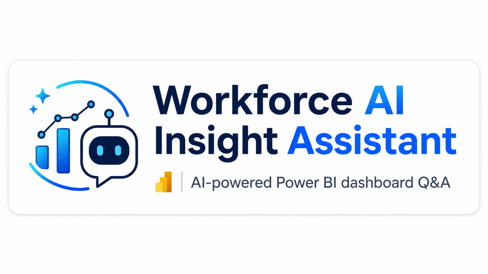

<h1 align="center">Hey 👋, I'm Nur Mohammad Ali</h1>
<h3 align="center">Doctoral student | Building AI-Enabled Systems for Manufacturing & Transportation | Data Analytics | LLM</h3>

  

<table>
<tr>
<td width="60%" valign="top">

## About Me

I am building **artificial intelligence-enabled systems for the industry and transportation sector**.  
My work combines **machine learning, data analytics, forecasting, supply chain intelligence, and applied AI** to solve real-world operational problems.

### More About Me

- 🔭 I’m currently working on **DriveSense AI — acoustic vehicle fault diagnosis**
- 🌱 I’m currently learning **Large Language Models, audio intelligence, and intelligent diagnostic systems**
- 👯 I’m open to collaborating on **AI, industrial analytics, transportation, and research projects**
- 💬 Ask me about **Python, SQL, forecasting, supply chain analytics, AI systems, and research**
- 📫 Reach me at **nipun.nur@gmail.com**
- 🌐 Portfolio: [nur-ali.com](https://nur-ali.com/)
- 📄 Career Profile: [My Career](https://nur-ali.com/MyCareer.html)

### Connect With Me

  

</td>
<td width="40%" align="center" valign="top">

  

</td>
</tr>
</table>

---

## Languages and Tools

<table align="center">
<tr>
<td align="center" width="100">
  
   <b>Python</b>
</td>

<td align="center" width="100">
  
   <b>MySQL</b>
</td>

<td align="center" width="100">
  
   <b>Jupyter</b>
</td>

<td align="center" width="100">
  
   <b>Google Cloud</b>
</td>

<td align="center" width="100">
  
   <b>BigQuery</b>
</td>

<td align="center" width="100">
  
   <b>Gemini</b>
</td>

<td align="center" width="100">
  
   <b>Power BI</b>
</td>

<td align="center" width="100">
  
   <b>Tableau</b>
</td>

<td align="center" width="100">
  
   <b>SAP</b>
</td>
</tr>
</table>

---

## GitHub Stats

  

  
  

  

---

## My Projects

<table>
<tr>
<td width="50%" align="center">
  
   
  <a href="https://drivesense-ai-app.streamlit.app/" target="_blank"><b>DriveSense AI</b></a>
   
  AI-enabled car acoustic diagnosis system
</td>

<td width="50%" align="center">
  
   
  <a href="https://ai-workforce-attrition-dashboard-assistant.streamlit.app/" target="_blank"><b>Workforce AI Insight Assistant</b></a>
   
  AI-powered Power BI dashboard Q&A using Streamlit and Gemini API
</td>
</tr>

<tr>
<td width="50%" align="center">
  
   
  <b>Customer Behavior Analysis Dashboard</b>
   
  Python + MySQL + Tableau analytics project
</td>

<td width="50%" align="center">
  
   
  <b>USA Car Sales Forecasting</b>
   
  Forecasting and comparison of actual vs ANN predictions
</td>
</tr>

<tr>
<td width="50%" align="center">
  
   
  <b>Personal Website</b>
   
  Portfolio, research, and career website
</td>

<td width="50%" align="center">
  
   
  <b>Workforce AI GitHub Repository</b>
   
  Source code, deployment files, and documentation
</td>
</tr>
</table>
